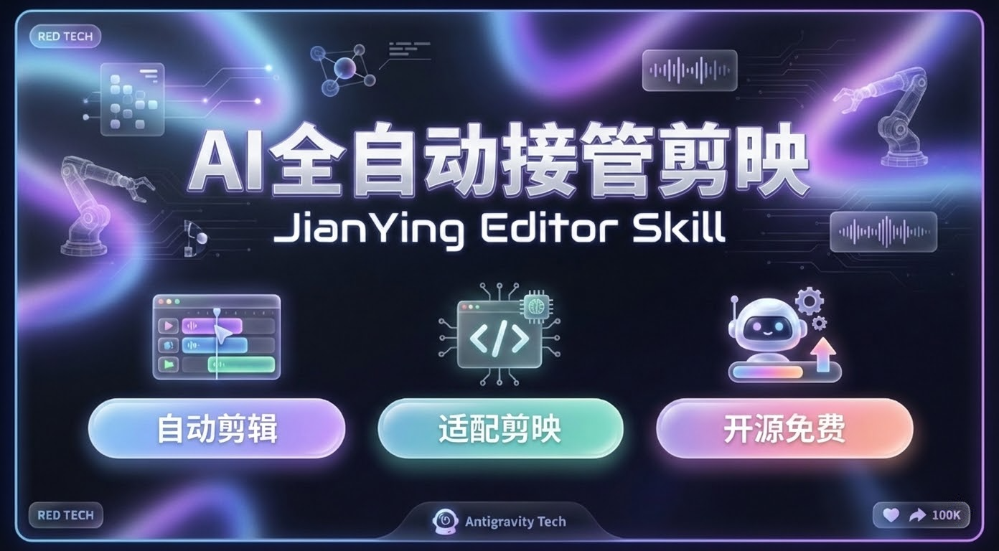

# JianYing Editor Skill for Antigravity


这是一个为 **AI Agent (Trae, Antigravity, Claude Code, Cursor)** 设计的通用专业级 Skill。它旨在赋予 AI“手眼”，使其能通过 Python 代码全自动生成、编辑和导出剪映（JianYing/CapCut 中国版）视频草稿。

不仅支持基础剪辑，更支持**网页动效生成 (Web-to-Video)** 和 **生成式 VFX**。

---

## 🚀 快速开始 (Quick Start)

### 1. 安装 Skill (Install)

请根据您使用的 AI 编辑器 (IDE)，选择对应的安装命令，以确保 Skill 能被自动识别：

**🤖 Antigravity / Gemini Code Assist:**
```bash
git clone https://github.com/luoluoluo22/jianying-editor-skill.git .agent/skills/jianying-editor
```

**🚀 Trae IDE:**
```bash
git clone https://github.com/luoluoluo22/jianying-editor-skill.git .trae/skills/jianying-editor
```

**🧠 Claude Code:**
```bash
git clone https://github.com/luoluoluo22/jianying-editor-skill.git .claude/skills/jianying-editor
```

**💻 Cursor / VSCode / 通用:**
```bash
# 通用方式：安装到根目录 include 列表
git clone https://github.com/luoluoluo22/jianying-editor-skill.git skills/jianying-editor
```
安装完成后，您可以在任何 AI 助手的对话框中直接下达指令（无需特定符号）：

> "请使用 jianying-editor 帮我创建一个名为 'MyDemo' 的剪映草稿，导入 output.mp4，并在开场添加一个标题。"


### 3. 查看示例代码 (Examples)
如果你是第一次使用，建议直接参考仓库中的标准示例：
- **[examples/simple_clip_demo.py](examples/simple_clip_demo.py)**: 包含初始化、导入视频、加音乐、加字幕的完整流程。让 Agent 学习这个文件是上手的最快方式。

### 4. 🗣️ 试试这样问 AI (示例)

**场景一：制作软件教程**
> "帮我启动录屏工具"

**场景二：快速配乐剪辑**
> "帮我把 `assets/` 里的视频导入剪映，配上那首 `audio.mp3` 的背景音乐，然后在视频开始的时候加一个‘复古打字机’效果的标题，内容是‘我的第一支 Vlog’。"

---

## 🌟 核心特性 (V3 进化版)

- **顶级素材接入**:
  - **banana (Imagen 3)**: 正式接入，支持一行指令生成 4K 电影级神兽/场景贴纸。
  - **Grok 3 (Media)**: 视觉天花板级图生视频，让你的静态素材瞬间化身史诗大片。
- **多轨管理**：支持视频、音频、字幕、贴纸、特效无限叠加，像专业剪辑师一样操作。
- **全自动闭环**: 从 Claude 4.5 剧本创作到素材生成，再到剪映草稿合成，一键全自动。
- **智能变焦**: 独家的 Smart Zoom 功能，能把普通的录屏自动变成“带镜头感”的演示视频。
- **自动导出**：内置自动化脚本，支持一键导出 1080P/4K 视频，彻底解放双手。

## 📦 环境准备 (必读)

为了让 Skill 正常工作，您需要在本地电脑上做一点点准备：

### 1. 安装 Python 依赖
此 Skill 的自动导出功能需要一个自动化库。请在终端运行：
```bash
pip install uiautomation
```

### 2. 确认剪映安装位置
Skill 默认认为您的剪映安装在 C 盘默认位置：
`C:\Users\Administrator\AppData\Local\JianyingPro\User Data\Projects\com.lveditor.draft`

**如果您的剪映安装在 D 盘或其他位置**，请在使用时直接告诉 AI：
> "我的剪映草稿目录在 D:\JianyingPro\..."

## 📂 文件夹说明

- `SKILL.md`: 给 AI 看的说明书。
- `references/`: 剪映代码库的参考文档。
- `tools/recording/`: **录屏神器**，都在这里面。
- `assets/`: 演示用的测试视频和音乐。

## ⚠️ 常见问题 (FAQ)

1. **看不到新生成的草稿？**
   剪映软件不会实时刷新文件列表。生成草稿后，请**重启剪映**，或者随便点进一个旧草稿再退出来，就能看到新的了。

2. **自动导出失败？**
   自动导出脚本模拟了鼠标键盘操作。
   - 运行导出时，请**不要**动鼠标和键盘。
   - 目前仅支持 **剪映 5.9 或更早版本** (新版本弹窗太多容易干扰脚本)。

## 🔄 如何更新 (Update)

当有新功能发布时，您可以输入以下命令一键更新：

```bash
cd .agent/skills/jianying-editor
git pull
```

## 📅 更新日志 (Changelog)

### v1.2 (2026-01-27) - 像变魔术一样！
- **✨ 智能变焦 (Smart Zoom)**:
  - 录制的教程视频太平淡？现在，它会自动帮你把镜头**推进特写**到鼠标点击的地方，就像电影镜头一样酷！
  - **自动红圈**：鼠标点哪里，那里就自动出现小红圈，观众一眼就能看到重点。
  - **丝滑跟随**：鼠标移动时，画面会像摄像机云台一样平滑跟随，再也不怕画面太小看不清了。
- **🎥 录屏神器大升级**:
  - 录完就能**一键生成草稿**！不用手动打开剪映，不用导入素材，点一下按钮，草稿就躺在你的剪映里了。
  - 终于支持连续录制了，一口气录十段素材也不用重启软件。
  - 录像文件会自动整理好，不再乱丢在桌面。

---
Developed by Antigravity Agent Lab.
